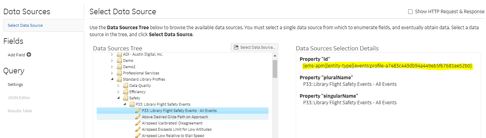

<!-- README.md is generated from README.Rmd. Please edit that file -->

```{r, include = FALSE}
knitr::opts_chunk$set(
  collapse = TRUE,
  comment = "#>",
  fig.path = "man/figures/README-",
  out.width = "100%"
)
```

# refoqa

<!-- badges: start -->
<!-- badges: end -->

refoqa is a tidyverse friendly R wrapper around the EMS/eFOQA API.  

The primary expected workflow for this wrapper is to use the 'Data Sources' Demo App / Developer Tool in EMS Online to navigate the EMS Tree and find all of the fields you want to use.  
  

Then you will use the query json that tool generates to get exactly the fields you wnat to query.

're'foqa because it is a bit of a 're'-write of the other EMS package (rems)

The benefits of this package over Rems are:  
1.  The functions (like 'filter' or 'select' in Rems) will not clash with dplyr verbs.  
2.  Credential management is easier.  
3.  Works with the 'Data Sources' App for interactive and precise field selection.  


## Installation

You can install the released version of refoqa from github with:

``` r
install.packages("devtools")
devtools::install_github("https://github.com/ge-flight-analytics/refoqa.git")
```

## Setup

refoqa expects you to store your EMS/eFOQA credentials and preferred server inside if your .Renviron file.
This means you don't have to ever pass your credentials to refoqa by hand!  Set it and forget it.
Plus this is considered best practice in R so that your credentials stay out of your script, history and git.

In Rstudio run:
``` r
usethis::edit_r_environ()
```
Add in these three lines and replace the example data with your efoqa user, password and server
```
# Example .Renviron file
EFOQAUSER=example.user
EFOQAPASSWORD=EXAMPLEPASSWORD
EFOQASERVER=https://d2mo-api.us.efoqa.com/api

```
Restart your R session, and you can test for success by doing:
``` r
Sys.getenv("EFOQASERVER")
```

## Some Quick Results

refoqa has a couple of pre-built queries to get you started.  To get some general information about the flights on your system try using standard_flight_query()

```{r flight_query_example}
library(refoqa)

all_flights <- standard_flight_query()

print(head(all_flights))

```

## Specifying the 'Data Source Id' (aka entity or database)

The 'data_source_id' will need to be specified when you want to query for something other than FDW Flights (for example flight safety events).
This is what controls what the 'rows' of your query are (flights, events, downloads, etc.)

Let's do an events query now.  In the 'data source' app in EMS online, copy the appropriate 'Data Source id'
  

```{r event_query_example}

example_event_data <- standard_event_query(
  event_data_source_id = "[ems-apm][entity-type][events:profile-a7483c449db94a449eb5f67681ee52b0]")

print(head(example_event_data))

```


## A Full Custom Query

Now let's do a full custom query.  Run through the full 'Data Source' app selecting the data source and fields.  In the end you will get a json query in the 'JSON Editor' tab.

  

Copy + Paste this json query to create a new json file in your R project.  Then pass it to 'database_query_from_json' along with the data source id and it will get executed.

```{r include = FALSE}
example_query_file <- system.file("extdata", "example_query.json", package = "refoqa")
example_analytics_query_file <- system.file("extdata", "analytic_query_example.json", package = "refoqa")
```

```{r}
custom_query_results <- database_query_from_json(data_source_id = "[ems-core][entity-type][foqa-flights]",
                                                 json_file = example_query_file)
print(head(custom_query_results))
```


### Notes

#### Field Formats

At least as of right now, the return type of each field is based on your query.  This means that in your json query, 
```
"format": "display" 
```
Will return all results as strings.  
```
"format": "none" 
```
Will return numbers.  

We may change at some point.

#### 'Top 10'

By default the Data Sources App will include a line limiting the results to just the first 10 records: 
```
  "top": 10
```
Delete this line to get all results.

## Other Potentially Useful Functions

### Analytics Query

This is super rough right now and may change, but you can query the 'analytics' API endpoint.  See the documentation in the EMS Online REST API Explorer for details on the json form of the query.  

```{r, include=FALSE}
library(ggplot2, quietly = TRUE)
```


```{r}

example_parameter_results <- analytics_query_from_json(flight_id = 3135409, query_json_file = example_analytics_query_file )

ggplot(data = example_parameter_results, aes(x = offset, y = pressure_altitude_ft)) +
  geom_line()

```

### Search Analytic Ids

```{r}
search_for_analytic( "Slat Operating Speed Maximum" )
```


### List APM Profiles  

You can get a list of all available profiles on the system with the list_all_apm_profiles() function:

```{r}

all_profiles <- list_all_apm_profiles()

print( all_profiles[[1]]$name )
example_profile_id <- all_profiles[[1]]$id
print( example_profile_id )
```


### APM Profile Glossary  

You can get a glossary of an APM profile in either json/list or csv/dataframe form

```{r, include=FALSE}
library(dplyr, quietly = TRUE)
```

```{r}

example_glossary <- apm_profile_glossary( profile_id = example_profile_id, glossary_format = "csv" )

example_glossary <- select(example_glossary, name, record_type, item_id, logical_id)
print(head(example_glossary))
```

You can also get a list of the events in a profile

```{r, include=FALSE}
example_profile_id <- "a7483c449db94a449eb5f67681ee52b0"
```


```{r}

example_events_df <- apm_events_glossary( profile_id = example_profile_id )

print( head( example_events_df ) )
```


