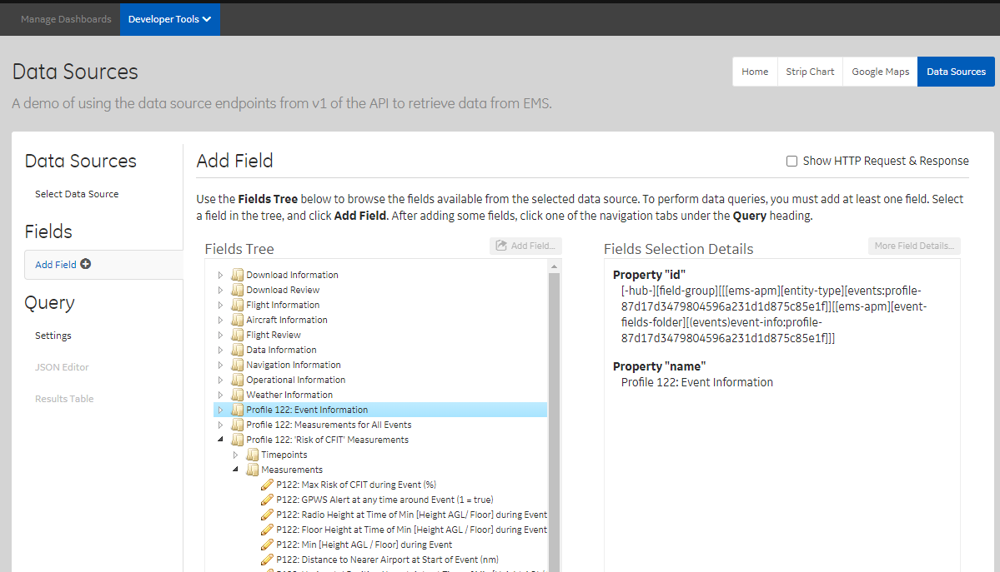
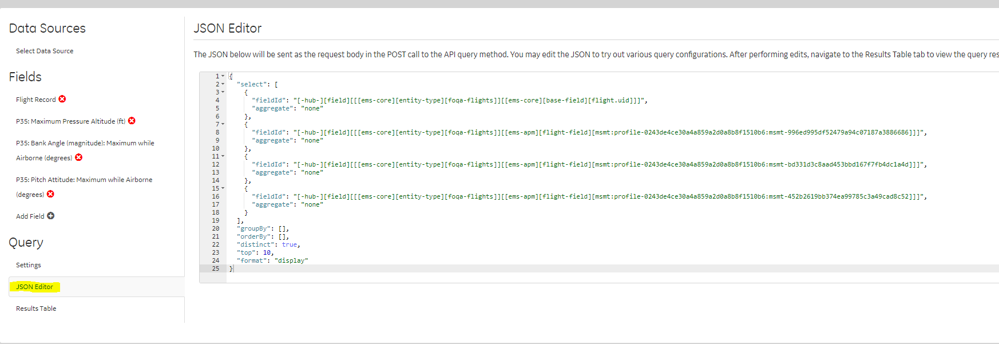

<!-- README.md is generated from README.Rmd. Please edit that file -->

# refoqa

<!-- badges: start -->
<!-- badges: end -->

refoqa is a tidyverse friendly R wrapper around the EMS/eFOQA API.

The primary expected workflow for this wrapper is to use the ‘Data
Sources’ Demo App / Developer Tool in EMS Online to navigate the EMS
Tree and find all of the fields you want to use.  


Then you will use the query json that tool generates to get exactly the
fields you wnat to query.

‘re’foqa because it is a bit of a ’re’-write of the other EMS package
(rems)

The benefits of this package over Rems are:  
1. The functions (like ‘filter’ or ‘select’ in Rems) will not clash with
dplyr verbs.  
2. Credential management is easier.  
3. Works with the ‘Data Sources’ App for interactive and precise field
selection.

## Installation

You can install the released version of refoqa from github with:

``` r
install.packages("devtools")
devtools::install_github("https://github.com/ge-flight-analytics/refoqa.git")
```

## Setup

refoqa expects you to store your EMS/eFOQA credentials and preferred
server inside if your .Renviron file. This means you don’t have to ever
pass your credentials to refoqa by hand! Set it and forget it. Plus this
is considered best practice in R so that your credentials stay out of
your script, history and git.

In Rstudio run:

``` r
usethis::edit_r_environ()
```

Add in these three lines and replace the example data with your efoqa
user, password and server

    # Example .Renviron file
    EFOQAUSER=example.user
    EFOQAPASSWORD=EXAMPLEPASSWORD
    EFOQASERVER=https://d2mo-api.us.efoqa.com/api

Restart your R session, and you can test for success by doing:

``` r
Sys.getenv("EFOQASERVER")
```

## Some Quick Results

refoqa has a couple of pre-built queries to get you started. To get some
general information about the flights on your system try using
standard\_flight\_query()

``` r
library(refoqa)

all_flights <- standard_flight_query()
#> Sending and opening an async-query to EMS ...
#> Done.
#> === Async call: 1 === 
#> Received up to  25000 rows.
#> === Async call: 2 === 
#> Received up to  45145 rows.
#> Async query connection (query ID: 6032347f-eeb9-4cae-bf28-5cc9185e5b41) deleted.
#> Done.

print(head(all_flights))
#> # A tibble: 6 x 15
#>   flight_record flight_date flight_number fleet    tail_number airframe
#>   <chr>         <chr>       <chr>         <chr>    <chr>       <chr>   
#> 1 3135409       Oct 2012    0             Fleet 14 GE-704      747-400 
#> 2 3135410       Oct 2012    0             Fleet 14 GE-704      747-400 
#> 3 3135417       Nov 2012    0             Fleet 14 GE-704      747-400 
#> 4 3135418       Nov 2012    0             Fleet 14 GE-704      747-400 
#> 5 3135421       Nov 2012    0             Fleet 14 GE-704      747-400 
#> 6 3135422       Nov 2012    0             Fleet 14 GE-704      747-400 
#> # ... with 9 more variables: airframe_engine_type <chr>, airframe_group <chr>,
#> #   takeoff_airport_icao_code <chr>, takeoff_airport_iata_code <chr>,
#> #   takeoff_runway_id <chr>, detected_approach <chr>,
#> #   landing_airport_icao_code <chr>, landing_airport_iata_code <chr>,
#> #   landing_runway_id <chr>
```

## Specifying the ‘Data Source Id’ (aka entity or database)

The ‘data\_source\_id’ will need to be specified when you want to query
for something other than FDW Flights (for example flight safety events).
This is what controls what the ‘rows’ of your query are (flights,
events, downloads, etc.)

Let’s do an events query now. In the ‘data source’ app in EMS online,
copy the appropriate ‘Data Source id’ 

``` r
example_event_data <- standard_event_query(
  event_data_source_id = "[ems-apm][entity-type][events:profile-a7483c449db94a449eb5f67681ee52b0]")
#> Sending and opening an async-query to EMS ...
#> Done.
#> === Async call: 1 === 
#> Received up to  25000 rows.
#> === Async call: 2 === 
#> Received up to  50000 rows.
#> === Async call: 3 === 
#> Received up to  56411 rows.
#> Async query connection (query ID: 64e1c479-2c8a-46f5-a21f-405c8b690b29) deleted.
#> Done.
#> Sending and opening an async-query to EMS ...
#> Done.
#> === Async call: 1 === 
#> Received up to  25000 rows.
#> === Async call: 2 === 
#> Received up to  50000 rows.
#> === Async call: 3 === 
#> Received up to  56411 rows.
#> Async query connection (query ID: 84b73bb6-7e04-43a2-982b-c9f42a5848a7) deleted.
#> Done.
#> Joining, by = c("flight_record", "event_record")

print(head(example_event_data))
#> # A tibble: 6 x 28
#>   flight_record event_record event_type        false_positive  severity  status 
#>   <chr>         <chr>        <chr>             <chr>           <chr>     <chr>  
#> 1 3135409       224779       Insufficient Eng~ Not a False Po~ Caution   FOQA: ~
#> 2 3135409       224780       Insufficient Eng~ Not a False Po~ Caution   FOQA: ~
#> 3 3135409       224782       Insufficient Eng~ Not a False Po~ Caution   Downgr~
#> 4 3135409       224784       Insufficient Eng~ Not a False Po~ Caution   Unknown
#> 5 3135410       224790       Airspeed Exceeds~ Not a False Po~ Informat~ Unknown
#> 6 3135410       224791       FDR/EMU Marker    Not a False Po~ Informat~ FOQA: ~
#> # ... with 22 more variables: baro_altitude_at_start_of_event_ft <dbl>,
#> #   height_agl_at_start_of_event_ft <dbl>,
#> #   height_above_takeoff_best_estimate_at_start_of_event_ft <dbl>,
#> #   height_above_touchdown_best_estimate_at_start_of_event_ft <dbl>,
#> #   airspeed_calibrated_at_start_of_event_knots <dbl>,
#> #   ground_speed_at_start_of_event_knots <dbl>,
#> #   mach_number_at_start_of_event <dbl>, ...
```

## A Full Custom Query

Now let’s do a full custom query. Run through the full ‘Data Source’ app
selecting the data source and fields. In the end you will get a json
query in the ‘JSON Editor’ tab.



Copy + Paste this json query to create a new json file in your R
project. Then pass it to ‘database\_query\_from\_json’ along with the
data source id and it will get executed.

``` r
custom_query_results <- database_query_from_json(data_source_id = "[ems-core][entity-type][foqa-flights]",
                                                 json_file = example_query_file)
#> Sending a regular query to EMS ...Done.
print(head(custom_query_results))
#> # A tibble: 6 x 4
#>   flight_record p35_maximum_pressu~ p35_bank_angle_magnit~ p35_pitch_attitude_m~
#>   <chr>         <chr>               <chr>                  <chr>                
#> 1 3135451       38054 ft            30.5859 degrees        15.6445 degrees      
#> 2 3135452       39016 ft            34.8047 degrees        17.4023 degrees      
#> 3 3137642       36003 ft            26.7186 degrees        14.7655 degrees      
#> 4 3137643       35022 ft            30.9373 degrees        14.5897 degrees      
#> 5 3137646       36024 ft            27.4217 degrees        14.0624 degrees      
#> 6 3137647       36008 ft            30.2342 degrees        14.7655 degrees
```

### Notes

#### Field Formats

At least as of right now, the return type of each field is based on your
query. This means that in your json query,

    "format": "display" 

Will return all results as strings.

    "format": "none" 

Will return numbers.

We may change at some point.

#### ‘Top 10’

By default the Data Sources App will include a line limiting the results
to just the first 10 records:

      "top": 10

Delete this line to get all results.

## Other Potentially Useful Functions

### Analytics Query

This is super rough right now and may change, but you can query the
‘analytics’ API endpoint. See the documentation in the EMS Online REST
API Explorer for details on the json form of the query.

``` r
example_parameter_results <- analytics_query_from_json(flight_id = 3135409, query_json_file = example_analytics_query_file )

ggplot(data = example_parameter_results, aes(x = offset, y = pressure_altitude_ft)) +
  geom_line()
#> Warning: Removed 2 row(s) containing missing values (geom_path).
```


### Search Analytic Ids

``` r
search_for_analytic( "Slat Operating Speed Maximum" )
#> [[1]]
#> [[1]]$id
#> [1] "H4sIAAAAAAAEAG2QQQvCMAyF74L/Yey+tk5BGHMg6GEwL8rAa+2qC3TdbDvrz7c6qg7N4RF4+chL0j3XrbjRk+B5xaWBM3AV3BshdQKrsDamSzC21iI7R6264JiQGT7uigOreUMjkNpQyXg4MG9Cv2yNKmooa6VRlBnPLzBZ4nUFqFQ0zKaTIEiHFFzlVeZbjbaNLtoLMCpS/DUwAg4dZy4z27g9ASQSxCo0qnd58P/BUsK1d7dmZKg4emq0eArx4uuz9wefTrw5/l32ACiTbuVSAQAA"
#> 
#> [[1]]$name
#> [1] "Slat Operating Speed Maximum (knots)"
#> 
#> [[1]]$description
#> [1] "Maximum indicated airspeed permitted with the slats extended as specified in the airplane flight manual."
#> 
#> [[1]]$units
#> [1] "knots"
```

### List APM Profiles

You can get a list of all available profiles on the system with the
list\_all\_apm\_profiles() function:

``` r
all_profiles <- list_all_apm_profiles()
#> Querying for the list of profiles

print( all_profiles[[1]]$name )
#> [1] "Approach Detection Prereqs"
example_profile_id <- all_profiles[[1]]$id
print( example_profile_id )
#> [1] "2becd333-b132-4880-ad2c-aa28f30e2cd9"
```

### APM Profile Glossary

You can get a glossary of an APM profile in either json/list or
csv/dataframe form

``` r
example_glossary <- apm_profile_glossary( profile_id = example_profile_id, glossary_format = "csv" )
#> Querying for the profile glossary
#> Done.
#> No encoding supplied: defaulting to UTF-8.
#> Joining, by = "record_type"

example_glossary <- select(example_glossary, name, record_type, item_id, logical_id)
print(head(example_glossary))
#> # A tibble: 6 x 4
#>   name                                record_type item_id logical_id            
#>   <chr>                               <chr>       <chr>   <chr>                 
#> 1 Beginning of File                   timepoint   0       383DAB63-BFF3-4B15-8F~
#> 2 End of File                         timepoint   1       FA806D6C-DFA4-474D-B8~
#> 3 Begin Airborne Interval             timepoint   2       25D29FB0-3150-472B-98~
#> 4 First Known Phase of Flight         timepoint   3       AD668953-0184-49F9-8A~
#> 5 Last Valid Data                     timepoint   4       3522561F-4087-4585-86~
#> 6 Rest of File is more than 80% sync~ timepoint   5       36507F42-F9FB-4EF3-BE~
```

You can also get a list of the events in a profile

``` r
example_events_df <- apm_events_glossary( profile_id = example_profile_id )
#> Querying for the profile glossary
#> Done.

print( head( example_events_df ) )
#> # A tibble: 6 x 3
#>      id name                                                 comments           
#>   <int> <chr>                                                <chr>              
#> 1     0 Low-Level Windshear                                  "This event indica~
#> 2     1 Risk of Ground Collision due to Low-Level Wind Shear "This event indica~
#> 3     2 EGT Limit Exceedance (Left Outboard Engine)          "This event indica~
#> 4     3 EGT Limit Exceedance (Left Inboard Engine)           "This event indica~
#> 5     4 EGT Limit Exceedance (Center Engine)                 "This event indica~
#> 6     5 EGT Limit Exceedance (Right Inboard Engine)          "This event indica~
```

### More Built In Queries

A built-in query for a summary of the airframe-engine types on the
system

``` r
airframe_summary <- standard_airframe_query()
#> Sending a regular query to EMS ...Done.

print( head( airframe_summary ) )
#> # A tibble: 6 x 5
#>   max_flight_record max_flight_date airframe_engine_t~ count_flight_re~ airframe
#>   <chr>             <chr>           <chr>                         <int> <chr>   
#> 1 5670603           Mar 2015        CRJ100/200 CF34-1~              373 CRJ100/~
#> 2 5439176           Dec 2015        767-400ER CF6-80               4764 767-400~
#> 3 5498858           Dec 2015        737-800 CFM56-7               10276 737-800 
#> 4 5499576           Dec 2015        757-200 PW2000                 7726 757-200 
#> 5 5575245           Dec 2015        777-200ER Trent 8~             1069 777-200~
#> 6 5427509           Dec 2015        777-200LR GE90-11~             1631 777-200~
```
