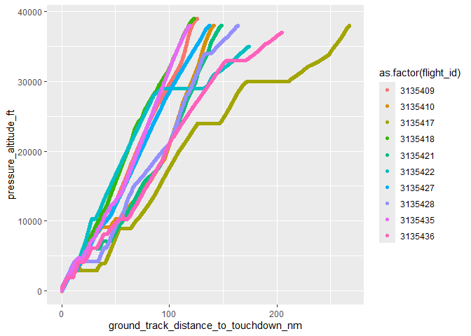
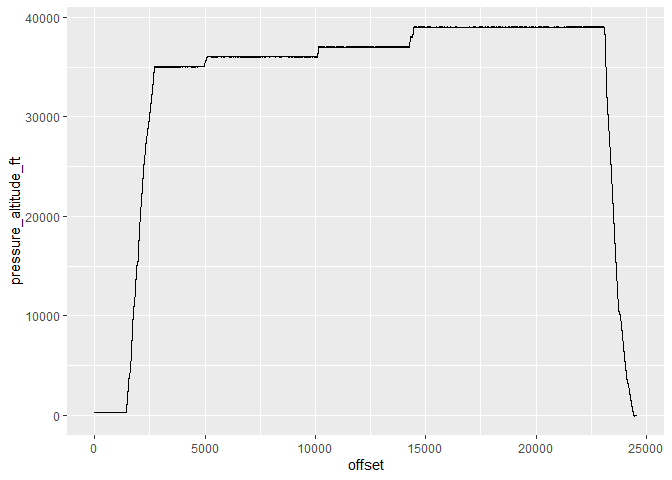

<!-- README.md is generated from README.Rmd. Please edit that file -->

# refoqa

<!-- badges: start -->
<!-- badges: end -->

refoqa is a tidyverse friendly R wrapper around the EMS/eFOQA API.

The primary expected workflow for this wrapper is to use the ‘Data
Sources’ Demo App / Developer Tool in EMS Online to navigate the EMS
Tree and find all of the fields you want to use.  


Then you will use the query json that tool generates to get exactly the
fields you wnat to query.

‘re’foqa because it is a bit of a ’re’-write of the other EMS package
(rems)

The benefits of this package over Rems are:  
1. The functions (like ‘filter’ or ‘select’ in Rems) will not clash with
dplyr verbs.  
2. Credential management is easier.  
3. Works with the ‘Data Sources’ App for interactive and precise field
selection.

## Installation

You can install the released version of refoqa from github with:

``` r
install.packages("devtools")
devtools::install_github("https://github.com/ge-flight-analytics/refoqa.git")
```

## Setup

refoqa expects you to store your EMS/eFOQA credentials and preferred
server inside if your .Renviron file. This means you don’t have to ever
pass your credentials to refoqa by hand! Set it and forget it. Plus this
is considered best practice in R so that your credentials stay out of
your script, history and git.

In Rstudio run:

``` r
usethis::edit_r_environ()
```

Add in these three lines and replace the example data with your efoqa
user, password and server

    # Example .Renviron file
    EFOQAUSER=example.user
    EFOQAPASSWORD=EXAMPLEPASSWORD
    EFOQASERVER=https://d2mo-api.us.efoqa.com/api

Restart your R session, and you can test for success by doing:

``` r
Sys.getenv("EFOQASERVER")
```

## Some Quick Results

refoqa has a couple of pre-built queries to get you started. To get some
general information about the flights on your system try using
standard_flight_query()

``` r
library(refoqa)
library(tidyverse)
#> ── Attaching packages ─────────────────────────────────────── tidyverse 1.3.2 ──
#> ✔ ggplot2 3.4.0      ✔ purrr   1.0.1 
#> ✔ tibble  3.1.8      ✔ dplyr   1.0.10
#> ✔ tidyr   1.2.1      ✔ stringr 1.5.0 
#> ✔ readr   2.1.3      ✔ forcats 0.5.2 
#> ── Conflicts ────────────────────────────────────────── tidyverse_conflicts() ──
#> ✖ dplyr::filter() masks stats::filter()
#> ✖ dplyr::lag()    masks stats::lag()

all_flights <- standard_flight_query()
#> Sending and opening an async-query to EMS ...
#> Done.
#> === Async call: 1 === 
#> Received up to  25000 rows.
#> === Async call: 2 === 
#> Received up to  45145 rows.
#> Async query connection (query ID: 8d54e5fd-6231-4246-a5ce-7a34b427beb8) deleted.
#> Done.

print(head(all_flights))
#> # A tibble: 6 × 15
#>   flight…¹ fligh…² fligh…³ fleet tail_…⁴ airfr…⁵ airfr…⁶ airfr…⁷ takeo…⁸ takeo…⁹
#>   <chr>    <chr>   <chr>   <chr> <chr>   <chr>   <chr>   <chr>   <chr>   <chr>  
#> 1 3135409  Oct 20… 0       Flee… GE-704  747-400 747-40… 747     RJAA    NRT    
#> 2 3135410  Oct 20… 0       Flee… GE-704  747-400 747-40… 747     PHNL    HNL    
#> 3 3135417  Nov 20… 0       Flee… GE-704  747-400 747-40… 747     RJAA    NRT    
#> 4 3135418  Nov 20… 0       Flee… GE-704  747-400 747-40… 747     RCTP    TPE    
#> 5 3135421  Nov 20… 0       Flee… GE-704  747-400 747-40… 747     RJAA    NRT    
#> 6 3135422  Nov 20… 0       Flee… GE-704  747-400 747-40… 747     RPLL    MNL    
#> # … with 5 more variables: takeoff_runway_id <chr>, detected_approach <chr>,
#> #   landing_airport_icao_code <chr>, landing_airport_iata_code <chr>,
#> #   landing_runway_id <chr>, and abbreviated variable names ¹​flight_record,
#> #   ²​flight_date, ³​flight_number, ⁴​tail_number, ⁵​airframe,
#> #   ⁶​airframe_engine_type, ⁷​airframe_group, ⁸​takeoff_airport_icao_code,
#> #   ⁹​takeoff_airport_iata_code
```

## Specifying the ‘Data Source Id’ (aka entity or database)

The ‘data_source_id’ will need to be specified when you want to query
for something other than FDW Flights (for example flight safety events).
This is what controls what the ‘rows’ of your query are (flights,
events, downloads, etc.)

Let’s do an events query now. In the ‘data source’ app in EMS online,
copy the appropriate ‘Data Source id’ 

``` r

example_event_data <- standard_event_query(
  event_data_source_id = "[ems-apm][entity-type][events:profile-a7483c449db94a449eb5f67681ee52b0]")
#> Sending and opening an async-query to EMS ...
#> Done.
#> === Async call: 1 === 
#> Received up to  25000 rows.
#> === Async call: 2 === 
#> Received up to  50000 rows.
#> === Async call: 3 === 
#> Received up to  58349 rows.
#> Async query connection (query ID: de41a11d-3d25-4436-ba99-8c8c989dc945) deleted.
#> Done.
#> Sending and opening an async-query to EMS ...
#> Done.
#> === Async call: 1 === 
#> Received up to  25000 rows.
#> === Async call: 2 === 
#> Received up to  50000 rows.
#> === Async call: 3 === 
#> Received up to  58349 rows.
#> Async query connection (query ID: 7302bbae-fa8f-49b2-ac66-10a948905e6b) deleted.
#> Done.
#> Joining, by = c("flight_record", "event_record")

print(head(example_event_data))
#> # A tibble: 6 × 28
#>   fligh…¹ event…² event…³ false…⁴ sever…⁵ status baro_…⁶ heigh…⁷ heigh…⁸ heigh…⁹
#>   <chr>   <chr>   <chr>   <chr>   <chr>   <chr>    <dbl>   <dbl>   <dbl>   <dbl>
#> 1 3135409 283120  Insuff… Not a … Caution Downg…      32      0    -129. -2.99e0
#> 2 3135409 283121  Insuff… Not a … Inform… Signi…      32      0    -129. -2.99e0
#> 3 3135409 283122  Insuff… Not a … Inform… Downg…      32      0    -129. -2.99e0
#> 4 3135409 283123  Insuff… Not a … Inform… Downg…      32      0    -129. -2.99e0
#> 5 3135410 283128  Airspe… Not a … Inform… Engin…    2856   2865.   2787.  2.66e3
#> 6 3135410 283129  FDR/EM… Not a … Inform… Engin…   36992  37998.  36911.  3.68e4
#> # … with 18 more variables: airspeed_calibrated_at_start_of_event_knots <dbl>,
#> #   ground_speed_at_start_of_event_knots <dbl>,
#> #   mach_number_at_start_of_event <dbl>,
#> #   pitch_attitude_captains_or_only_at_start_of_event_deg <dbl>,
#> #   angle_of_attack_best_available_at_start_of_event_deg <dbl>,
#> #   roll_attitude_captains_or_only_at_start_of_event_deg <dbl>,
#> #   vertical_speed_at_start_of_event_ft_min <dbl>, …
```

## A Full Custom Query

Now let’s do a full custom query. Run through the full ‘Data Source’ app
selecting the data source and fields. In the end you will get a json
query in the ‘JSON Editor’ tab.


Copy + Paste this json query to create a new json file in your R
project. Then pass it to ‘database_query_from_json’ along with the data
source id and it will get executed.

``` r
custom_query_results <- database_query_from_json(data_source_id = "[ems-core][entity-type][foqa-flights]",
                                                 json_file = example_query_file)
#> Sending a regular query to EMS ...Done.
print(head(custom_query_results))
#> # A tibble: 6 × 6
#>   flight_record fleet    airframe p35_maximum_pressure_altitud…¹ p35_b…² p35_p…³
#>   <chr>         <chr>    <chr>    <chr>                          <chr>   <chr>  
#> 1 3193189       Fleet 03 A320-200 36072 ft                       24.257… 17.929…
#> 2 3203702       Fleet 03 A320-200 34048 ft                       25.312… 16.874…
#> 3 3208826       Fleet 03 A320-200 38036 ft                       26.015… 15.117…
#> 4 3208827       Fleet 03 A320-200 35064 ft                       27.773… 16.523…
#> 5 3211863       Fleet 03 A320-200 34052 ft                       25.312… 17.578…
#> 6 3211868       Fleet 03 A320-200 35044 ft                       28.476… 17.226…
#> # … with abbreviated variable names ¹​p35_maximum_pressure_altitude_ft,
#> #   ²​p35_bank_angle_magnitude_maximum_while_airborne_degrees,
#> #   ³​p35_pitch_attitude_maximum_while_airborne_degrees
```

### Notes

#### Field Formats

At least as of right now, the return type of each field is based on your
query. This means that in your json query,

    "format": "display" 

Will return all results as strings.

    "format": "none" 

Will return numbers.

We may change at some point.

#### ‘Top 10’

By default the Data Sources App will include a line limiting the results
to just the first 10 records:

      "top": 10

Delete this line to get all results.

## Full Flight Data ‘Analytics’ Queries

This is super rough right now and may change, but you can query the
‘analytics’ API endpoint. See the documentation in the EMS Online REST
API Explorer for details on the json form of the query.

``` r

example_parameter_results <- analytics_query_from_json(flight_id = 3135409, query_json_file = example_analytics_query_file )

ggplot(data = example_parameter_results, aes(x = offset, y = pressure_altitude_ft)) +
  geom_line()
#> Warning: Removed 3 rows containing missing values (`geom_line()`).
```


You can run an analytics query on multiple flight records with:

``` r
query_as_r_list <- jsonlite::read_json(example_analytics_query_file)
multiple_results <- analytics_query_multiflight(flight_ids=c(3135409, 3135410), query_list = query_as_r_list)

multiple_results %>%
  dplyr::group_by(flight_id) %>%
  dplyr::summarise(max_alt = max(pressure_altitude_ft, na.rm = TRUE))
#> # A tibble: 2 × 2
#>   flight_id max_alt
#>       <dbl>   <dbl>
#> 1   3135409   39049
#> 2   3135410   38035
```

You can optionally specify start and end times too if you have them. You
will have to pipe in the offsets from the database queries above. For
example I have a stored query here that gets the timepoint Top of
Descent to Touchdown for 10 flights. Note: The format = ‘none’ option is
useful in these timepoint queries

``` r
flight_dataframe <-  database_query_from_json(data_source_id = "[ems-core][entity-type][foqa-flights]",
                                              json_file = example_timepoint_query_file)
#> Sending a regular query to EMS ...Done.
names( flight_dataframe ) <- c("flight_record", "top_of_descent", "touchdown")
print(head(flight_dataframe))
#> # A tibble: 6 × 3
#>   flight_record top_of_descent touchdown
#>           <int>          <dbl>     <dbl>
#> 1       3135409          23086    24420 
#> 2       3135410          27852    29719 
#> 3       3135417          10522    13967.
#> 4       3135418           8337     9556.
#> 5       3135421          15320    17084 
#> 6       3135422          11650    13351.
```

And then we can do our same query but pass in these timepoints as the
start and end.

``` r
query_as_r_list <- jsonlite::read_json(example_analytics_query_file)
tod_to_touchdown <- analytics_query_multiflight(flight_ids=flight_dataframe$flight_record,
                                                query_list = query_as_r_list,
                                                start_offsets = flight_dataframe$top_of_descent,
                                                end_offsets = flight_dataframe$touchdown)

ggplot(data = tod_to_touchdown, aes(x = ground_track_distance_to_touchdown_nm, y = pressure_altitude_ft, color=as.factor(flight_id))) +
  geom_point()
#> Warning: Removed 6 rows containing missing values (`geom_point()`).
```



And an option to do this without specifying a flight record if you want
to ( refoqa will select a random flight for you). Mostly useful for
system maintenance type uses, but it is here if you want it.

``` r
example_parameter_results <- analytics_query_with_unspecified_flight( query_list = query_as_r_list )
#> Sending a regular query to EMS ...Done.

ggplot(data = example_parameter_results, aes(x = offset, y = pressure_altitude_ft)) +
  geom_line()
#> Warning: Removed 3 rows containing missing values (`geom_line()`).
```



### Search Analytic Ids

``` r
search_for_analytic( "Slat Operating Speed Maximum" )
#> [[1]]
#> [[1]]$id
#> [1] "H4sIAAAAAAAEAG2QQQvCMAyF74L/Yey+tk5BGHMg6GEwL8rAa+2qC3TdbDvrz7c6qg7N4RF4+chL0j3XrbjRk+B5xaWBM3AV3BshdQKrsDamSzC21iI7R6264JiQGT7uigOreUMjkNpQyXg4MG9Cv2yNKmooa6VRlBnPLzBZ4nUFqFQ0zKaTIEiHFFzlVeZbjbaNLtoLMCpS/DUwAg4dZy4z27g9ASQSxCo0qnd58P/BUsK1d7dmZKg4emq0eArx4uuz9wefTrw5/l32ACiTbuVSAQAA"
#> 
#> [[1]]$name
#> [1] "Slat Operating Speed Maximum (knots)"
#> 
#> [[1]]$description
#> [1] "Maximum indicated airspeed permitted with the slats extended as specified in the airplane flight manual."
#> 
#> [[1]]$units
#> [1] "knots"
#> 
#> [[1]]$metadata
#> NULL
```

## Helpers for Discretes or Dimensions

The ‘data sources’ app and json query are not great for handling
discretes or dimensions. Here are a few helper functions to help out.

### Get Possible Dimension/Discrete States

One way to work around this is to get the EMS ids for the possible
discretes. Then you can type these in by hand into your json query.
There are some build in id_table queries to get these lists.

``` r

airframe_id_table <- get_airframe_id_table()
print( head( airframe_id_table ) )
#> # A tibble: 6 × 2
#>   local_id discrete_string
#>      <dbl> <chr>          
#> 1      190 172S           
#> 2       83 717-200        
#> 3      185 727-200        
#> 4      167 737 (BBJ)      
#> 5      169 737 (BBJ2)     
#> 6      159 737 (BBJ3)

airframe_engine_id_table <- get_airframe_engine_id_table()
print( head( airframe_engine_id_table ) )
#> # A tibble: 6 × 2
#>   local_id discrete_string   
#>      <dbl> <chr>             
#> 1      245 172S IO-360       
#> 2      124 717-200 BR715     
#> 3      243 727-200 JT8D      
#> 4      212 737 (BBJ) CFM56-7 
#> 5      224 737 (BBJ2) CFM56-7
#> 6      222 737 (BBJ3) CFM56-7
```

Or you can get a table of possible discrete states for any field you
want.

``` r
fleet_table <- get_dimension_table(data_source_id = "[ems-core][entity-type][foqa-flights]",
                                   field_id = "[-hub-][field][[[ems-core][entity-type][foqa-flights]][[ems-core][base-field][flight.fleet]]]")
print(head(fleet_table))
#> # A tibble: 6 × 2
#>   local_id discrete_string
#>      <dbl> <chr>          
#> 1        3 Fleet 03       
#> 2        4 Fleet 04       
#> 3        5 Fleet 05       
#> 4        6 Fleet 06       
#> 5        7 Fleet 07       
#> 6        8 Fleet 08
```

### Append Dimension/Discrete Filter by String

There is a helper to tack on a filter for a specific string version of a
particular field to an input query.

``` r
example_query_list <- jsonlite::read_json(example_query_file)

flight_query_for_fleet_03 <- filter_dimension_by_string(
  data_source_id = "[ems-core][entity-type][foqa-flights]",
  query_list = example_query_list,
  field_id = "[-hub-][field][[[ems-core][entity-type][foqa-flights]][[ems-core][base-field][flight.fleet]]]",
  dimension_string = "Fleet 03")

fleet_03_flights <- database_query_from_list( data_source_id = "[ems-core][entity-type][foqa-flights]",
                                              query_list = flight_query_for_fleet_03)
#> Sending a regular query to EMS ...Done.
print(head(fleet_03_flights))
#> # A tibble: 6 × 6
#>   flight_record fleet    airframe p35_maximum_pressure_altitud…¹ p35_b…² p35_p…³
#>   <chr>         <chr>    <chr>    <chr>                          <chr>   <chr>  
#> 1 3193189       Fleet 03 A320-200 36072 ft                       24.257… 17.929…
#> 2 3203702       Fleet 03 A320-200 34048 ft                       25.312… 16.874…
#> 3 3208826       Fleet 03 A320-200 38036 ft                       26.015… 15.117…
#> 4 3208827       Fleet 03 A320-200 35064 ft                       27.773… 16.523…
#> 5 3211863       Fleet 03 A320-200 34052 ft                       25.312… 17.578…
#> 6 3211868       Fleet 03 A320-200 35044 ft                       28.476… 17.226…
#> # … with abbreviated variable names ¹​p35_maximum_pressure_altitude_ft,
#> #   ²​p35_bank_angle_magnitude_maximum_while_airborne_degrees,
#> #   ³​p35_pitch_attitude_maximum_while_airborne_degrees
```

And some helpers for specific dimensions

``` r
flight_query_for_737 <- filter_airframe_engine_by_string(
  query_list = example_query_list,
  target_airframe_engine_string = "737-800 CFM56-7")

flights_737 <- database_query_from_list( data_source_id = "[ems-core][entity-type][foqa-flights]",
                                              query_list = flight_query_for_737)
#> Sending a regular query to EMS ...Done.
print(head(flights_737))
#> # A tibble: 6 × 6
#>   flight_record fleet    airframe p35_maximum_pressure_altitud…¹ p35_b…² p35_p…³
#>   <chr>         <chr>    <chr>    <chr>                          <chr>   <chr>  
#> 1 3137698       Fleet 19 737-800  35968 ft                       30.410… 18.105…
#> 2 3137733       Fleet 19 737-800  30018 ft                       29.882… 21.796…
#> 3 3137877       Fleet 19 737-800  37015 ft                       31.113… 19.160…
#> 4 3137878       Fleet 19 737-800  33970 ft                       25.664… 15.996…
#> 5 3137881       Fleet 19 737-800  36018 ft                       33.925… 16.523…
#> 6 3137884       Fleet 19 737-800  37013 ft                       25.664… 17.050…
#> # … with abbreviated variable names ¹​p35_maximum_pressure_altitude_ft,
#> #   ²​p35_bank_angle_magnitude_maximum_while_airborne_degrees,
#> #   ³​p35_pitch_attitude_maximum_while_airborne_degrees
```

## Other Potentially Useful Functions

### List APM Profiles

You can get a list of all available profiles on the system with the
list_all_apm_profiles() function:

``` r

all_profiles <- list_all_apm_profiles()
#> Querying for the list of profiles

print( all_profiles[[1]]$name )
#> [1] "Approach Detection Prereqs"
example_profile_id <- all_profiles[[1]]$id
print( example_profile_id )
#> [1] "2becd333-b132-4880-ad2c-aa28f30e2cd9"
```

### APM Profile Glossary

You can get a glossary of an APM profile in either json/list or
csv/dataframe form

``` r

example_glossary <- apm_profile_glossary( profile_id = example_profile_id, glossary_format = "csv" )
#> Querying for the profile glossary
#> Done.
#> No encoding supplied: defaulting to UTF-8.
#> Joining, by = "record_type"

example_glossary <- select(example_glossary, name, record_type, item_id, logical_id)
print(head(example_glossary))
#> # A tibble: 6 × 4
#>   name                                                   recor…¹ item_id logic…²
#>   <chr>                                                  <chr>   <chr>   <chr>  
#> 1 Beginning of File                                      timepo… 0       383DAB…
#> 2 End of File                                            timepo… 1       FA806D…
#> 3 Begin Airborne Interval                                timepo… 2       25D29F…
#> 4 First Known Phase of Flight                            timepo… 3       AD6689…
#> 5 Last Valid Data                                        timepo… 4       352256…
#> 6 Rest of File is more than 80% sync errors and next su… timepo… 5       36507F…
#> # … with abbreviated variable names ¹​record_type, ²​logical_id
```

You can also get a list of the events in a profile

``` r

example_events_df <- apm_events_glossary( profile_id = example_profile_id )
#> Querying for the profile glossary
#> Done.

print( head( example_events_df ) )
#> # A tibble: 6 × 3
#>      id name                                                 comments           
#>   <int> <chr>                                                <chr>              
#> 1     0 Low-Level Windshear                                  "This event indica…
#> 2     1 Risk of Ground Collision due to Low-Level Wind Shear "This event indica…
#> 3     2 EGT Limit Exceedance (Left Outboard Engine)          "This event indica…
#> 4     3 EGT Limit Exceedance (Left Inboard Engine)           "This event indica…
#> 5     4 EGT Limit Exceedance (Center Engine)                 "This event indica…
#> 6     5 EGT Limit Exceedance (Right Inboard Engine)          "This event indica…
```

### More Built In Queries

A built-in query for a summary of the airframe-engine types on the
system

``` r

airframe_summary <- standard_airframe_query()
#> Sending a regular query to EMS ...Done.

print( head( airframe_summary ) )
#> # A tibble: 6 × 5
#>   max_flight_record max_flight_date airframe_engine_type    count_flig…¹ airfr…²
#>   <chr>             <chr>           <chr>                          <int> <chr>  
#> 1 5670603           Mar 2015        CRJ100/200 CF34-1/3              373 CRJ100…
#> 2 5439176           Dec 2015        767-400ER CF6-80                4764 767-40…
#> 3 5498858           Dec 2015        737-800 CFM56-7                10276 737-800
#> 4 5499576           Dec 2015        757-200 PW2000                  7726 757-200
#> 5 5575245           Dec 2015        777-200ER Trent 800             1069 777-20…
#> 6 5427509           Dec 2015        777-200LR GE90-110/115B         1631 777-20…
#> # … with abbreviated variable names ¹​count_flight_record, ²​airframe
```

### Misc

Get details on any EMS schema field

``` r
field_details <- get_database_field_details(
  data_source_id = "[ems-core][entity-type][foqa-flights]",
  field_id = "[-hub-][field][[[ems-core][entity-type][foqa-flights]][[airframe-engine-field-set][base-field][airframe-engine]]]")
print(names(field_details))
#> [1] "discreteValues" "id"             "type"           "name"          
#> [5] "path"
```

Get a dataframe of all physical parameters for a particular flight
record

``` r
physical_parameters_for_flight <- get_physical_parameters_for_flight(3135409)

print( head( select( physical_parameters_for_flight, name, units, uid) ) )
#> # A tibble: 6 × 3
#>   name                   units uid     
#>   <chr>                  <chr> <chr>   
#> 1 A/P ALT HOLD MODE OPER ""    APALTHLD
#> 2 A/P ALTITUDE MODE OPER ""    APALTMD 
#> 3 A/P CAUTION            ""    APCAUT  
#> 4 A/P CMD C ENGA         ""    APCMDCEN
#> 5 A/P CMD L ENGA         ""    APCMDLEN
#> 6 A/P CMD R ENGA         ""    APCMDREN
```

Get a dataframe of all physical parameters for all PDCs/LFLs on the
system

``` r
all_physical_parameters <- get_all_physical_parameters()
#> Sending a regular query to EMS ...Done.

print( head( select( all_physical_parameters, name, flight_physical_data_configuration_id ) ) )
#> # A tibble: 6 × 2
#>   name                 flight_physical_data_configuration_id
#>   <chr>                <chr>                                
#> 1 A/C NUMBER           Fleet 23                             
#> 2 A/C TYPE             Fleet 23                             
#> 3 A/P CAUTION C FCC    Fleet 23                             
#> 4 A/P CAUTION L FCC    Fleet 23                             
#> 5 A/P CAUTION R FCC    Fleet 23                             
#> 6 A/P CMD C ENGA C FCC Fleet 23
```

Get a dataframe of all logical items (parameters and constants) on the
system

``` r
all_logical_items <- get_logical_FDW_item_list()

print( head( select( all_logical_items, name, description, item_type ) ) )
#> # A tibble: 6 × 3
#>   name                        description                                item_…¹
#>   <chr>                       <chr>                                      <chr>  
#> 1 FWC- Rud Trav Lim           ""                                         logica…
#> 2 GMT (hrs)                   "Greenwich Mean Time (i.e. the time at th… logica…
#> 3 Subframe Identifier         ""                                         logica…
#> 4 Sync Error (error if > 0.5) "A synchronization error (a disruption of… logica…
#> 5 APU Command On (1=On)       "The flight-deck switch for activating th… logica…
#> 6 APU EGT (deg C)             "Exhaust Gas Temperature (EGT) of the Aux… logica…
#> # … with abbreviated variable name ¹​item_type
```
